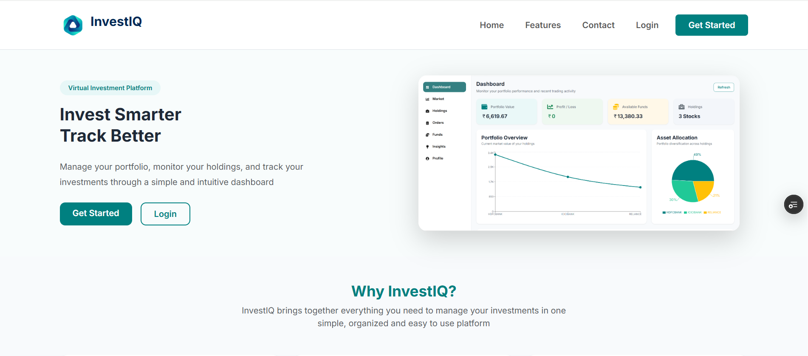
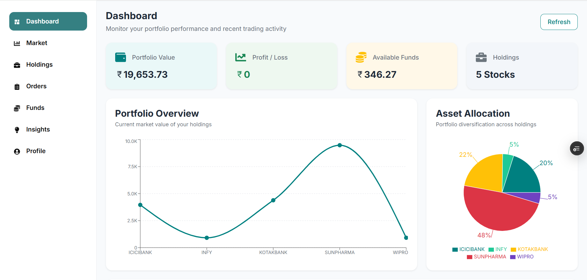
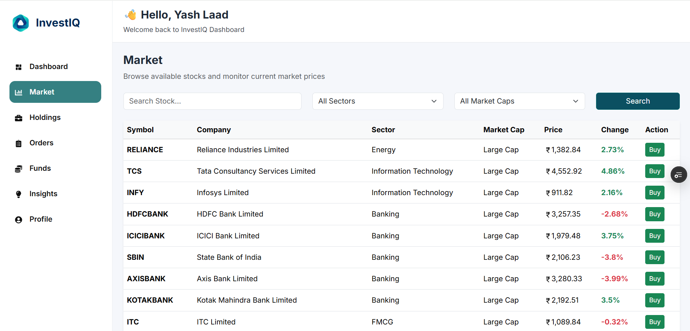
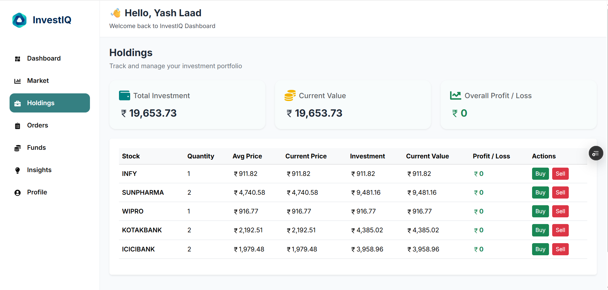

# **InvestIQ**

> A full-stack virtual stock portfolio management platform built with the MERN stack.


---

## 🚀 Live Demo

🌐 **Frontend -** **[Live Demo](https://invest-iq-tau.vercel.app/)**

⚙️ **Backend -** **[Render Server](https://investiq-backend-nr86.onrender.com)**

---
 
## 📌 Overview

InvestIQ is a full-stack virtual stock portfolio management platform where users can explore market data, buy and sell virtual stocks, track their portfolio, manage funds, view order history, and analyze investment performance through interactive charts and insights.

---

## ✨ Features

- 🔐 JWT Authentication
- 📊 Interactive Dashboard
- 📈 Market Explorer with Search & Filters
- 💼 Holdings Management
- 💸 Buy & Sell Virtual Stocks
- 📑 Order History
- 💰 Funds Management
- 📉 Portfolio Insights & Charts
- 👤 User Profile
- 📱 Responsive UI

---

## 🛠 Tech Stack

**Frontend**

- React.js
- React Router
- Bootstrap
- React Icons
- Recharts

**Backend**

- Node.js
- Express.js
- MongoDB
- Mongoose
- JWT Authentication

**Deployment**

- Vercel
- Render

---

## 📸 Application Preview

| Landing Page | Dashboard |
|--------------|-----------|
|  |  |

| Market | Holdings |
|---------|----------|
|  |  |

---

## ⚙️ Installation

```bash
git clone https://github.com/RACHITALAAD/InvestIQ.git
cd InvestIQ
```
### Backend

```bash
cd backend
npm install
npm start
```
### Frontend

```bash
cd frontend
npm install
npm start
```

---

## 🔑 Environment Variables

Create a `.env` file inside the backend directory.

```env
MONGO_URL = your_mongodb_connection_string

JWT_SECRET = your_secret_key
```

---

## 👩‍💻 Author

### Rachita Laad

**GitHub -** **[RACHITALAAD](https://github.com/RACHITALAAD)**

**LinkedIn -** **[Rachita Laad](https://www.linkedin.com/in/rachitalaad885/)**

---

⭐ If you found this project interesting, feel free to give it a star!